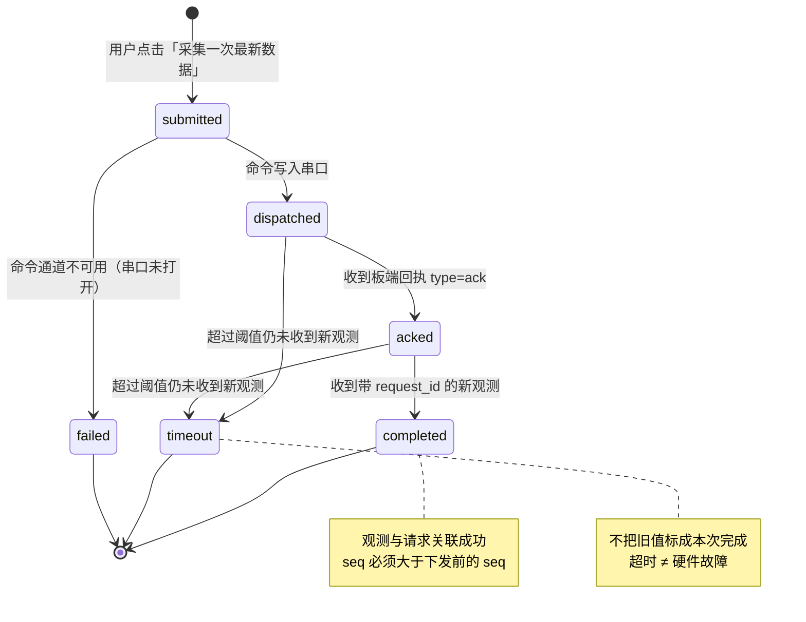
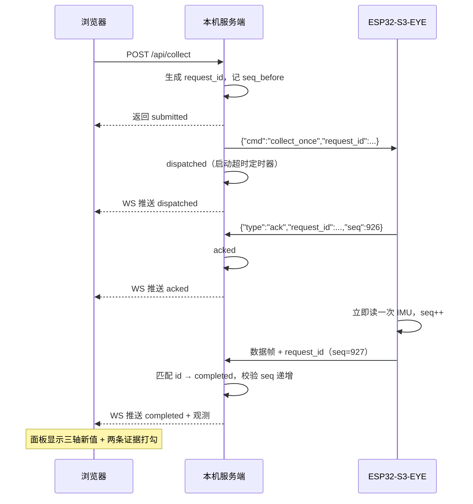

# 第 2 周：Web 远程采集指令与执行结果反馈

> 本周问题：点击「采集一次最新数据」，怎样证明开发板进行了**新采集**，而非页面重新显示了数据库中的**旧值**？

---

## 一、本周问题的答案

**核心手段：`request_id` 闭环 + 板端序号递增。**

页面**不读数据库的最后一条**来当本次结果；本次结果只认**带本次 `request_id` 的观测**。
而数据库里的旧记录**根本不含这个 id**，物理上无法冒充。

四条证据缺一不可：

| # | 证据 | 说明 |
|---|------|------|
| ① | **request_id 回环** | 服务端生成 → 下发 → 板端原样回传。旧记录没有这个 id |
| ② | **板端 seq 严格递增** | 观测的 `seq` 必须大于下发前的 `seq` —— 证明是**新采样**，不是重发 |
| ③ | **时间先后** | 观测到达服务端的时刻，必须晚于命令下发时刻 |
| ④ | **页面只认 id** | 「本次新观测」面板只渲染带该 id 的观测；超时则明确显示"没有新观测"，**绝不回退显示旧值** |

界面上 ①②③ 会**逐条打勾展示**，超时/失败时观测区显示"本次没有收到新观测"，不留任何旧值。

---

## 二、协议

命令与数据**共用同一条 USB 串口**（控制台即 USB-Serial-JTAG），每行一条 JSON。
**未改动底层通信协议**，只在上面叠加了一层命令语义。

### 下行（服务端 → 板端）

```jsonc
{"cmd":"collect_once","request_id":"req-20260918-102921-0001"}   // 立即采集一次
{"cmd":"pause"}                                                   // 暂停周期上报（命令通道保持）
{"cmd":"resume"}                                                  // 恢复周期上报
{"cmd":"ping","request_id":"..."}                                 // 连通性探测
```

### 上行（板端 → 服务端）

```jsonc
// 回执：证明板子收到了这条命令
{"type":"ack","device":"S3EYE-GROUP01","request_id":"req-...","seq":926,"status":"received"}

// 观测 = 普通数据帧 + request_id 字段（复用同一条解析链路，照常落盘）
{"device":"S3EYE-GROUP01","mac":"...","seq":927,"request_id":"req-...","ts":...,"acc_x_g":-0.3202,...}
```

> **关键设计**：观测帧就是普通数据帧多带一个 `request_id`，因此**不需要新增解析分支**，
> 落盘、展示、历史查询全部复用。`type:"ack"` 的行则单独处理，不当作传感数据。

---

## 三、状态机（首版状态图）



### 状态清单

| 状态 | 中文 | 触发条件 | 前端表现 |
|------|------|---------|---------|
| `submitted` | 已提交 | 服务端创建请求 | 时间线第 1 步打勾 |
| `dispatched` | 已下发 | 命令成功写入串口 | 第 2 步打勾 + 时间戳 |
| `acked` | 设备已接收 | 收到板端 `type:"ack"` | 第 3 步打勾 + `ack=received` |
| `completed` | 完成 | 收到带本次 `request_id` 的观测 | 第 4 步打勾，展示三轴数值与证据 |
| `timeout` | 超时 | 超阈值未收到新观测 | 红色标记 + "没有新观测，不用旧值代替" |
| `failed` | 失败 | 命令通道不可用 | 红色标记 + 具体原因 |

> 另有 `mockDevice` 模拟模式：服务端自答回执与观测，用于无板联调。
> **所有模拟结果都带 `simulated` 标记**，界面显示红色「模拟」徽章，绝不冒充实物命令。

---

## 四、时序



**注意**：命令通道**独立于数据通道**。暂停周期上报后，命令通道仍然有效
（这正是当堂验证要考察的点）。

---

## 五、当堂验证步骤与实测结果

| 步骤 | 操作 | 预期 | 实测 |
|------|------|------|------|
| 1 | 点「暂停周期上报」 | 曲线停止刷新，命令通道保持 | ✅ 数据停止，`reportPaused=true` |
| 2 | 保持暂停，点「采集一次最新数据」 | 收到**新观测**，带 request_id | ✅ `completed`，seq **1043→1044** |
| 3 | 改变设备姿态后采集 | 新观测反映当前姿态 | ✅ 数值随姿态变化 |
| 4 | 关闭/断开设备后采集 | 等待后超时，**旧值不能被标成本次完成** | ✅ `timeout`，观测区为空 |
| 5 | 连续点击多次 | 每次独立 request_id，各自采样 | ✅ 3 次独立 id，seq 1793→94 / 1795→96 / 1797→98 |

> 超时 ≠ 硬件故障 —— 界面明确提示这一点，只报告"本次未收到新观测"。

---

## 六、文件改动清单

| 文件 | 改动 |
|------|------|
| `firmware/s3eye_imu_idf/main/main.c` | 抽出 `build_frame()`/`send_frame()`；新增 `cmd_task` 命令接收任务、`json_str()` 解析、`cmd_ack()`、`cmd_collect_once()`、`handle_command()`；`s_report_paused` 暂停开关 |
| `server.js` | `REQUESTS` 请求存储与状态机、`sendCommand()` 串口下发、`onDeviceAck()`/`onObservation()`/`onRequestTimeout()`；路由 `POST /api/collect`、`GET /api/collect[/:id]`、`POST /api/report`；WS `type:"collect"` 推送；配置项 `mockDevice`、`collectTimeoutMs` |
| `public/index.html` | `#collect` 页：采集按钮、状态时间线、本次观测、周期上报开关 |
| `public/app.js` | `renderCollect()` / `doCollect()` / `loadCollect()` / `renderCollectMode()`；WS 处理 `collect` 消息 |
| `public/style.css` | 时间线 `.steps`、模拟徽章 `.badge-sim`、观测网格 `.obs-grid` |
| `config.json` | 新增 `mockDevice`、`collectTimeoutMs` |

---

## 七、为什么"本机电脑当服务器"也成立

```
浏览器（本机或局域网任意设备）
      ↓ HTTP / WebSocket
本机电脑 = 服务器（0.0.0.0:8080，NDJSON 落盘）
      ↓ USB 串口（双向）
ESP32-S3-EYE
```

没有 VPS，但「远程」依然成立：浏览器可以在**局域网内任意设备**打开页面点按钮，
命令照样下发到开发板。串口本来就是双向的，加一条命令通道即可，**不需要重写底层协议**。
