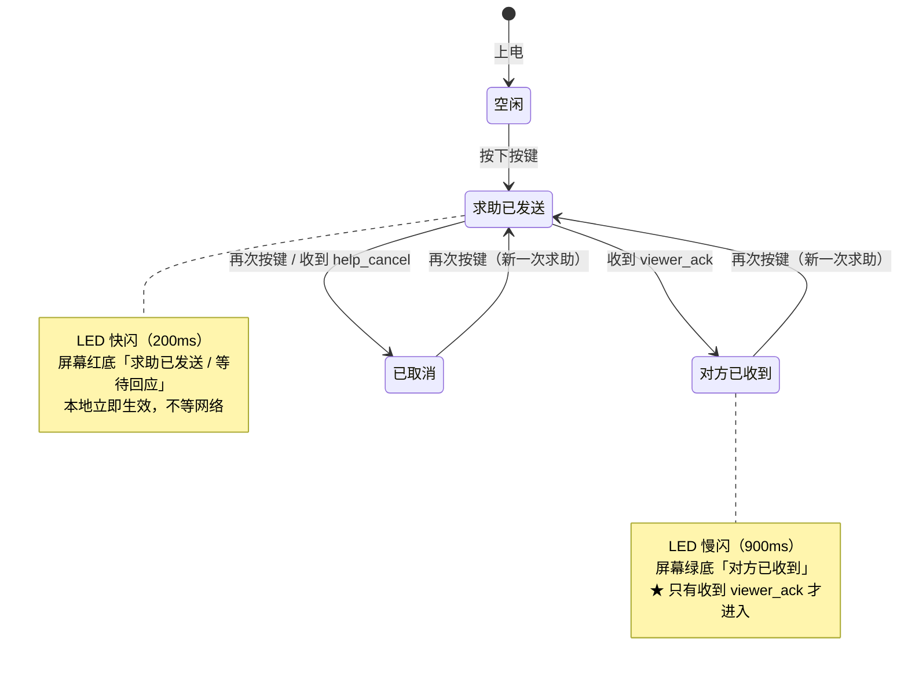
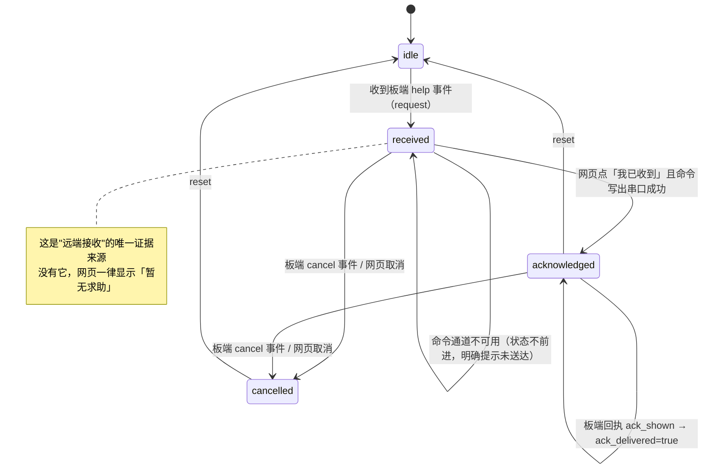
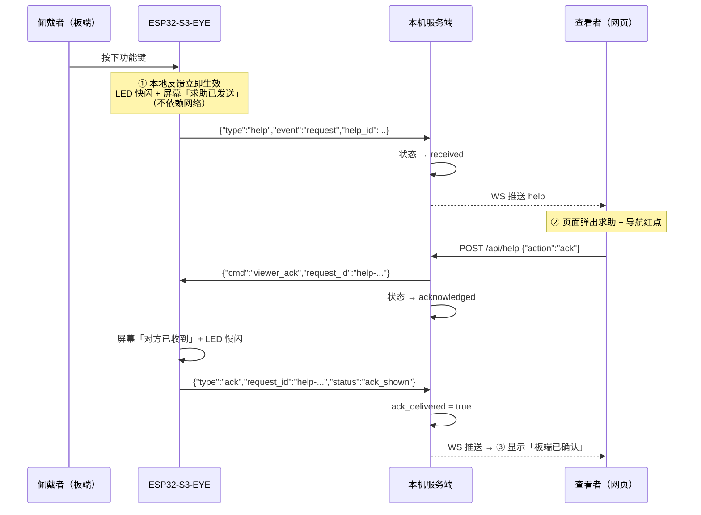
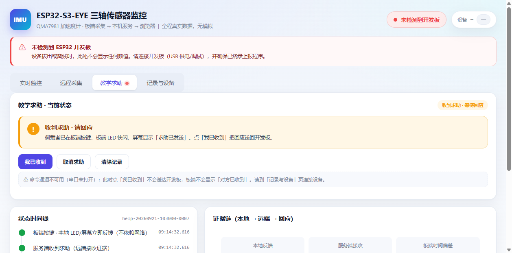

# 第 3 周：按键触发与物理反馈闭环

> 本周问题：佩戴者按下按键，**自己**和**查看信息的人**分别应获得什么反馈？

---

## 一、本周问题的答案：三种反馈，三层含义

| 阶段 | 谁看到 | 反馈形式 | 含义 | 是否依赖网络 |
|------|--------|----------|------|--------------|
| ① **本地确认** | 佩戴者 | 板端 LED 快闪 + 屏幕「求助已发送」 | 「我按下了，板子确实收到了」 | ❌ **完全不依赖** |
| ② **远端接收** | 查看者 | 网页弹出求助 + 状态「等待回应」 | 「消息已经到达服务端」 | ✅ 依赖 |
| ③ **查看者回应** | 双方 | 网页点「我已收到」→ 板端屏幕「对方已收到」+ LED 慢闪 | 「对方看到了」 | ✅ 依赖 |

**三者不可颠倒、不可伪造**：

- ① 在**按下瞬间**完成，哪怕 WiFi 断了、服务端没开，LED 和屏幕照样变化 —— 这是"本地确认"的意义。
- ② 只有服务端**真正收到**板端上报的求助事件，网页才会显示求助。
- ③ 板端**只有收到服务端下发的 `viewer_ack` 命令**，才允许显示「对方已收到」；
  在此之前，无论网页上点了什么，板端都不会显示这句话。

---

## 二、硬件依据（来自官方 ESP32-S3-EYE v2.2 用户指南 + esp-bsp，非猜测）

| 用途 | 硬件 | 引脚 | 关键约束 |
|------|------|------|----------|
| 按键 | 6 个功能按键（电阻分压 → ADC） | **GPIO1**（ADC1_CH0） | 无按键时被上拉至接近满量程；按下不同键得到不同电压（参考值 2410/1980/820/380，另有 BOOT 键 GPIO0） |
| LED | 仅 1 颗 Module Power LED（绿色） | **GPIO3** | ★ **必须开漏输出**，软件拉高会烧 LED（v2.2 已加 R83 限流，仍应遵守） |
| 屏幕 | 1.3" 240×240 ST7789（SPI3） | PCLK=21 / MOSI=47 / DC=43 / CS=44 / 背光=48 | GPIO43/44 是 UART0 的 TX/RX，但本固件控制台走 USB-Serial-JTAG，故可自由使用 |
| 提示音 | **板载没有扬声器/蜂鸣器** | — | 音频只有输入（数字 MEMS 麦克风）；实体反馈只能用 LED + 屏幕 |

> **与老师开发板的差异**：本板按键是 **ADC 电阻分压式**（不是独立 GPIO），且**没有蜂鸣器**。
> 因此本周用 **LED + LCD** 实现实体反馈，功能等价、不依赖声音。

**按键阈值的自适应校准**：上电时采样 60 次取最大值作为「空闲基准」，按下判定阈值 = 基准 − 500。
这样不同板子、不同批次都能工作；日志会打印校准结果便于现场核对。

---

## 三、协议

求助事件复用**与数据帧完全相同的双通道**（USB 串口 + WiFi POST `/api/data`），
因此服务端**不需要新增传输层**，只在既有 `handleLine()` 里加一个分支。

### 上行（板端 → 服务端）

```jsonc
// 发起求助 / 取消求助（同一格式，event 不同）
{"type":"help","event":"request","help_id":"help-20260921-101000-0001",
 "device":"S3EYE-GROUP01","mac":"...","seq":130,"src":"s3eye","ts":...,"iso":"..."}

{"type":"help","event":"cancel","help_id":"help-20260921-101000-0001", ...}
```

### 下行（服务端 → 板端）

```jsonc
{"cmd":"viewer_ack","request_id":"help-20260921-101000-0001"}   // 查看者已回应
{"cmd":"help_cancel","request_id":"help-..."}                   // 查看者取消
{"cmd":"help_reset"}                                            // 清除
```

### 板端回执（复用既有 ack 通道）

```jsonc
{"type":"ack","device":"S3EYE-GROUP01","request_id":"help-...","seq":130,"status":"ack_shown"}
```

> `request_id` 以 `help-` 开头，服务端据此把回执路由到**求助模块**（而不是采集请求表），
> 从而形成"**板端已确认显示「对方已收到」**"的最终证据。

### HTTP 接口

| 方法 | 路径 | 说明 |
|------|------|------|
| GET | `/api/help` | 当前求助状态 + 命令通道状态 |
| POST | `/api/help` | `{"action":"ack"｜"cancel"｜"reset"}` |

> **下行通道有两条**：`viewer_ack` / `help_cancel` 与采集命令一样 —— 串口在线时走 USB 串口；
> 串口不在线时，板端每 400ms `GET /api/cmd?device=...` 来取（**WiFi 轮询**）。
> 因此**拔掉 USB 线，求助闭环依然完整**（这正是"独立网络"要求的落地）。
> 命令**入队 ≠ 已送达**：只有串口写出成功、或板端确实在轮询，才认为可送达；
> 否则如实提示"尚未送达设备"，绝不声称对方已收到。

---

## 四、状态机

### 板端（LED + 屏幕）



### 服务端



---

## 五、时序



---

## 五之一、界面



导航「教学求助」上的**红点**提示有待回应的求助。页面自上而下为：
求助告警 → 三个操作按钮（我已收到 / 取消求助 / 清除记录）→ 命令通道提示 → 状态时间线 → 证据链。

---

## 六、当堂验证（两条硬指标）

| # | 验证项 | 操作 | 预期 | 实现保证 |
|---|--------|------|------|----------|
| 1 | **断开外网后，本地仍能确认按键已触发** | 拔掉/关闭网络，按下功能键 | LED 立即快闪、屏幕显示「求助已发送」 | 本地反馈在 `on_button_press()` 里**先于**上报执行；上报失败不影响 LED/屏幕 |
| 2 | **无远端接收证据时不得显示「对方已收到」** | 不按板端键，直接在网页点「我已收到」 | 明确提示"没有待回应的求助" | 服务端 `createHelpAck()` 在 `active=false` 时直接拒绝 |
| 2b | 同上 | 串口未连接时点「我已收到」 | 状态**不前进**，提示"回应未送达设备，板端不会显示「对方已收到」" | `sendCommand()` 返回 false → 不置 acknowledged |
| 2c | 同上 | 板端未收到命令时 | 板端屏幕**绝不**出现「对方已收到」 | 板端只在 `cmd == "viewer_ack"` 分支里改屏幕 |

### 服务端实测（curl 模拟板端上报）

```
1) 初始状态            status=idle  active=False
2) 板端上报求助         → status=received  help_id=help-...-0001  seq=123  channelReady=False
3) 点「已收到」(无串口)  ok=False  status=received  ack_channel_ok=False  ack_delivered=None
                        note=⚠ 回应未送达设备：命令通道不可用（串口未打开）。板端不会显示「对方已收到」。
4) 板端取消            → status=cancelled  active=False
5) 模拟模式回应         status=acknowledged  mockDevice=True
                        note=模拟模式：回应未走真实串口（仅供联调，不代表板端已显示）。
6) 板端回执 ack_shown   → ack_delivered=True
                        note=板端已回执：屏幕已显示「对方已收到」。
7) 复位                → status=idle
事件历史：received → ack_failed → cancelled → received → ack_mock → reset → received → ack_delivered
```

### 烧录与开机实测（已通过）

固件已烧录到 COM4（966736 字节，哈希校验通过）。开机日志确认三个新子系统全部就绪：

```
I (1503) gpio: GPIO[3]| OutputEn: 1| OpenDrain: 1        ← LED 开漏模式生效（不会烧）
I (1625) S3EYE: LCD 初始化完成（240x240 ST7789, SPI3）   ← 屏幕 OK
I (2226) S3EYE: 按键 ADC 校准：空闲=4095，判定阈值<3595   ← 按键 OK
I (200)  app_init: App version: fe028d8                  ← 与提交一致
```

服务端同时确认：`connected=True  live=True  transport=serial  deviceId=S3EYE-GROUP01`，
数据帧 seq 持续递增。

**实物命令通道测试**（直接向板子发命令并读回执）：

| 发送 | 板端回执 | 结论 |
|------|----------|------|
| `viewer_ack`（板子空闲） | `status:"no_active_help"` | ★ 板端**拒绝**显示「对方已收到」——硬指标②在实物上成立 |
| `ping` | `status:"pong"` | 命令通道正常 |
| `help_reset` | `status:"idle"` | 正常 |
| `collect_once` | `received` + 观测帧 seq **1546→1547** | 第 2 周功能无回归 |

完整日志见 [`week3-flash-evidence.txt`](week3-flash-evidence.txt)。

### 待人工补验（需按下板上按键）

| 步骤 | 预期 |
|------|------|
| 按一下功能键 | LED 快闪 + 屏幕「求助已发送 / 等待回应」；网页出现求助 |
| 网页点「我已收到」 | 板端 LED 慢闪 + 屏幕「对方已收到」；网页显示"板端已确认" |
| 求助中再按键 | 屏幕「已取消」，网页显示已取消 |
| 拔掉网线后按键 | LED 与屏幕**照常**变化（本地确认成立） |

---

## 七、文件改动清单

| 文件 | 改动 |
|------|------|
| `firmware/s3eye_imu_idf/main/main.c` | 新增 `led_init/led_write`（GPIO3 开漏）、`lcd_init/lcd_fill/lcd_draw_zh/lcd_draw_ascii/lcd_show_*`（ST7789）、`utf8_next()`、`btn_init/btn_task`（ADC 自适应校准 + 去抖）、求助状态机 `on_button_press/send_help_event/new_help_id`、`ui_task`（LED 闪烁 + 屏幕刷新）；`handle_command()` 增加 `viewer_ack/help_cancel/help_reset`；`http_upload` 抽出为通用 `http_post()` |
| `firmware/s3eye_imu_idf/main/lcd_font.h` | **自动生成**的点阵字模（中文 32×32 × 25 字 + ASCII 8×16） |
| `firmware/s3eye_imu_idf/tools/gen_font.py` | 字模生成脚本（PIL + simhei），同时输出预览图 |
| `server.js` | 求助模块：`help` 状态、`publicHelp/pushHelp/onHelpEvent/createHelpAck/createHelpCancel/onHelpAck/resetHelp`；`handleLine()` 增加 `type:"help"` 分支；`onDeviceAck()` 把 `help-*` 路由到求助模块；路由 `GET/POST /api/help`；WS hello 带 `help`。**另补 WiFi 下行通道**：命令队列 + `GET /api/cmd`（板端轮询取命令），`sendCommand()` 串口优先、否则入队，只有确认可送达才返回成功 |
| `firmware/.../main/main.c` | 新增 `http_get()` 与 `poll_task()`（每 `CMD_POLL_INTERVAL_MS` 取一次命令，复用同一个 `handle_command()`） |
| `public/index.html` | 新增 `#help` 分页 + 导航红点徽章 |
| `public/app.js` | `renderHelp/renderHelpChannel/helpAction/loadHelp`；`PAGES` 增加 `help`；WS 处理 `help` 消息 |
| `public/style.css` | `.tab-badge`、`.help-alert`（中性/警示/成功三态） |
| `test/help-test.js` | 第 3 周自动化测试（18 项，独立端口 8097）：状态不前进 / 回执确认 / 不污染数据链路 |
| `docs/week3-button-feedback.md` | 本文档 |

---

## 八、备用路径与迁移

- **共享设备结对轮换**：本周功能全部由**一个按键 + 一块屏幕**完成，任意一台 ESP32-S3-EYE 都能直接跑，无需额外配件。
- **模拟操作保留标识**：服务端 `mockDevice` 模式下的回应一律带 `mockDevice:true` 与说明文案，界面不会把它当成真实送达。
- **实体输入与反馈必须补验**：模拟只能验证服务端状态机；**按键、LED、屏幕三者必须在实物上补验**（见第六节"待实物验证"）。
- **向个人项目迁移**：确认/取消机制已抽象为「`help_id` + 状态机 + 回执」三段式，迁移时只需替换
  ① 触发源（按键 → 触摸/语音/传感器阈值）、② 反馈执行器（LED+屏幕 → 马达/蜂鸣器）、
  ③ 传输通道（串口/WiFi → 任意 MQTT/HTTP）。协议字段与状态语义可原样复用。
